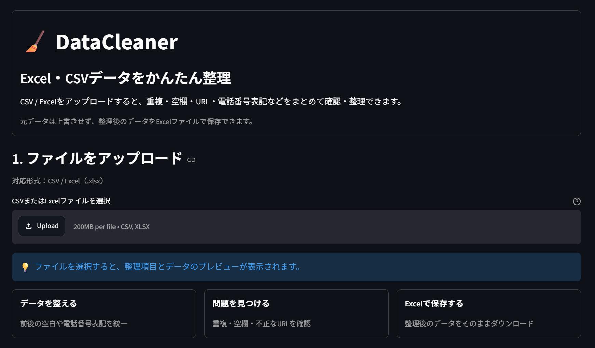
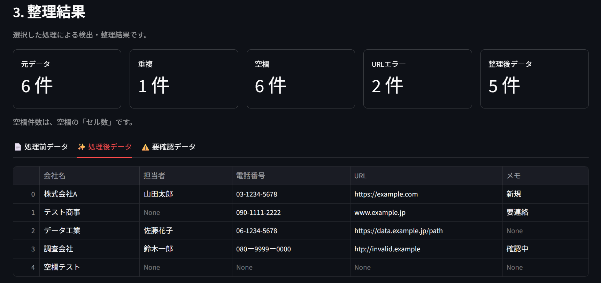
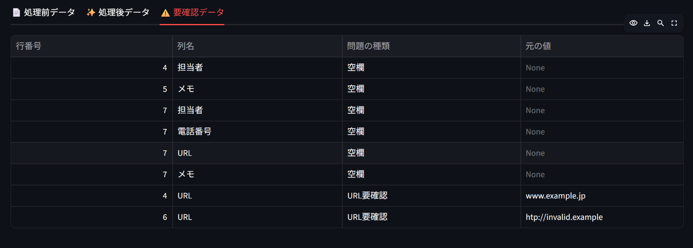

# DataCleaner

CSV / Excel データをブラウザ上で確認し、**重複・空欄・URL・電話番号表記などを簡単に整理できるWebアプリ**です。

Python と Streamlit を使用して作成しており、データ整理や事務作業の効率化を想定しています。

## スクリーンショット

### ファイル読み込み・整理項目の設定



### 整理結果



### 要確認データ



## ツール概要

DataCleaner は、CSV / Excel ファイルをアップロードすると、選択した処理を自動で実行し、整理前後のデータを比較できるツールです。

処理後のデータは新しい Excel ファイルとしてダウンロードできるため、元ファイルを上書きせずに利用できます。

## 主な機能

* CSV / Excel（`.xlsx`）ファイルのアップロード
* 処理前・処理後データのプレビュー
* 文字列の前後にある不要な空白の削除
* 完全一致する重複行の検出・削除
* 空欄セルの検出
* URL形式のチェック
* 電話番号の全角数字を半角数字へ変換
* 電話番号のハイフン表記を統一
* 問題があるデータを「要確認データ」として一覧表示
* 整理結果の件数表示
* 整理後データの Excel ダウンロード

## 使用技術

* Python
* Streamlit
* pandas
* openpyxl

## 動作確認

実際に複数のテストデータを使用し、以下のケースで動作確認を行いました。

* 通常の Excel データ
* 完全一致する重複行を含むデータ
* 空欄セルを含むデータ
* 不正な形式の URL を含むデータ
* 全角数字や異なるハイフン表記を含む電話番号
* 文字列の前後に空白が含まれるデータ
* 想定していた列名とは異なる Excel データ
* データがほとんど入っていない Excel ファイル

想定外の列構成でもアプリが停止せず、利用可能な処理のみを実行できることを確認しています。

## 工夫した点

### 1. 元データを勝手に変更しない設計

不正な URL や空欄など、機械的に正しい値を判断できない項目については、自動修正を行わず「要確認データ」として表示するようにしました。

これにより、誤った値への自動変換を防ぎながら、確認が必要な箇所を効率よく見つけられます。

### 2. 処理前後を簡単に比較できるUI

「処理前データ」「処理後データ」「要確認データ」をタブで切り替えられるようにし、どのようにデータが変更されたか確認しやすくしました。

### 3. 初めて使う人でも操作しやすい画面構成

画面を以下の4ステップに分けています。

1. ファイルをアップロード
2. 整理する内容を選択
3. 整理結果を確認
4. 整理後データを保存

専門的な操作を覚えなくても、画面の流れに沿って利用できる構成を意識しました。

### 4. データ形式への依存を抑えた設計

会社情報だけでなく、商品データなど異なる列構成の Excel ファイルでも処理できるようにしています。

URLや電話番号については列名から候補を自動選択し、必要に応じてユーザーが対象列を変更できます。

## インストール方法

Python 3.10 以上を用意し、このリポジトリのフォルダで以下を実行します。

### 仮想環境の作成

```bash
python -m venv .venv
```

### 仮想環境の有効化

Windows：

```bash
.venv\Scripts\activate
```

macOS / Linux：

```bash
source .venv/bin/activate
```

### 必要なライブラリのインストール

```bash
python -m pip install -r requirements.txt
```

## 起動方法

以下のコマンドを実行します。

```bash
python -m streamlit run app.py
```

ブラウザで DataCleaner が起動したら、CSV または Excel ファイルをアップロードしてください。

## サンプルデータ

`sample_data/sample_dirty.csv` に、動作確認用のサンプルデータを用意しています。

以下のようなケースが含まれています。

* 重複行
* 空欄
* 不正なURL
* 全角の電話番号
* 前後に空白がある文字列

DataCleaner の各機能を簡単に確認できます。

## プロジェクト構成

```text
DataCleaner/
├─ app.py
├─ requirements.txt
├─ README.md
├─ docs/
│  └─ images/
│     ├─ 01_main.png
│     ├─ 02_result.png
│     └─ 03_review.png
├─ sample_data/
│  └─ sample_dirty.csv
└─ src/
   ├─ __init__.py
   ├─ cleaner.py
   ├─ file_utils.py
   └─ validators.py
```

## 今後の改善案

* より多くのデータ形式への対応
* 日付や郵便番号などの表記統一
* 処理内容の詳細レポート出力
* 大規模データへの対応
* 自動テストの追加
